🎄 Jingle Bells - Christmas E-commerce Platform 🎄
Welcome to Jingle Bells! This is a seasonal e-commerce platform crafted to bring the holiday spirit straight to your doorstep with a wide variety of Christmas-themed products. From festive decorations and ornaments to unique gift items, Jingle Bells offers everything you need to make the holidays truly special.

🎁 Features
Festive Catalog: Explore a curated collection of holiday products, including Christmas tree ornaments, wreaths, lights, gift wrapping essentials, and other seasonal decor.
User-Friendly Interface: A smooth and joyful shopping experience designed to spread holiday cheer while making online shopping easy.
Responsive Design: Enjoy Jingle Bells on any device, whether you're browsing on mobile, tablet, or desktop.
Effortless Navigation: Easily find categories like "Tree Decorations," "Gift Ideas," "Stocking Stuffers," and "Outdoor Decor."
Safe Checkout: Secure payment options to ensure peace of mind while you shop for loved ones.
🎅 Getting Started
These instructions will help you set up the Jingle Bells e-commerce platform on your local machine for development and testing.

Prerequisites
Web Browser: Any modern browser (Chrome, Firefox, Safari, etc.)
Text Editor: Preferably Visual Studio Code or Sublime Text for editing HTML, CSS, and JavaScript files.
Local Server: XAMPP or WAMP for local testing of PHP files (if server-side code is used).
Installation
Clone the Repository:

bash
Copy code
git clone https://github.com/danielsamyy/jingle-bells.git
Open the Project:

Navigate to the project folder in your preferred text editor.
Start a Local Server:

Use a local server tool like XAMPP or WAMP to run the project locally if PHP or databases are involved.
Launch in Browser:

Open index.html in your browser to start exploring the Jingle Bells site.

📂 Project Structure
index.php: Home page featuring holiday products and offers.
category.php: Product category pages organized for easy navigation.
feedback.php: A feedback page for customer reviews and suggestions.
about.php: Information about the Jingle Bells brand and its mission.
login.php: User login page to enable customer accounts.
styles/: CSS files for styling the website.
scripts/: JavaScript files for interactive functionality.
images/: Folder containing all visual assets, including product images and festive banners.

🛠 Technologies Used
HTML5 & CSS3: For structuring and styling the platform.
JavaScript: Adds interactivity and dynamic elements.
PHP (optional): For backend functionalities like handling user feedback (only if server-side features are implemented).
MySQL (optional): Database to store user accounts, product information, and orders.

🌟 Key Functionalities
Product Browsing:

Easily navigate through a festive collection of Christmas products.
Search and Filters:

Search bar and filters allow customers to find specific items or browse categories effortlessly.
User Feedback:

Customers can leave feedback on their shopping experience, helping improve the platform.
Account Management:

Login and registration functionality, allowing users to save their favorite items and checkout easily.
✨ Future Enhancements
Wishlist Feature: Allow users to save products to a wishlist for future reference.
Personalized Recommendations: Suggest products based on user preferences and browsing history.
Holiday Deals and Discounts: Seasonal sales and exclusive discounts for registered users.

🎁 Features

### User Features

- **User Registration and Login**:
  - Secure system for users to create accounts and authenticate.
  - Passwords are hashed for security.
  - Validation checks for input fields to ensure data integrity.

- **Product Browsing**:
  - View all available christmas products with images, descriptions, and prices.
  - Search and filter options to find specific products.
  - Responsive design for optimal viewing on various devices.

- **Shopping Cart**:
  - Add products to a cart and manage item quantities.
  - View cart summary with total prices.
  - Remove items or update quantities before checkout.

- **Feedback Page**:
  - Collects user feedback to improve the platform.
  - Includes questions about user experience and suggestions.

### Admin Features

- **Product Management**:
  - Add new products with details like name, description, price, and image.
  - Update existing product information.
  - Delete products from the inventory.

- **View All Products**:
  - Administrators can see all products in a table format.
  - Options to edit or delete each product directly from the list.

- **User Management**:
  - Monitor user accounts and activity.
  - Potential to implement features like blocking users or resetting passwords.

- **Security**:
  - Admin area protected by authentication.
  - Only authorized personnel can access administrative functionalities.

## Technologies Used

- **Front-End**:
  - HTML5: Structuring the web content.
  - CSS3: Styling and layout of web pages.
  - Responsive Design Techniques for mobile compatibility.

- **Back-End**:
  - PHP: Server-side scripting for dynamic content.
  - MySQL: Relational database management.

- **Tools and Platforms**:
  - Apache Server (via XAMPP).
  - phpMyAdmin for database management.
  - IDE or code editor like VSCode or Sublime Text.

- **Security Measures**:
  - Input validation to prevent SQL injection and XSS attacks.
  - Password hashing using PHP's password_hash function.

## Installation Instructions

1. **Clone the Repository**:

   ```bash
   git clone https://github.com/danielsamyy/jingle-bells.git
   ```

2. **Setup Database**:

   - Use phpMyAdmin or MySQL command line to import `jingle_bells.sql` into your MySQL server.
   - Create a database named `jingle_bells` if it doesn't exist.

3. **Configure Database Connection**:

   - Open `connection.php`.
   - Ensure the database credentials match your local setup:

     ```php
     <?php
     $database = mysqli_connect('localhost', 'root', '', 'jingle_bells');
     ```

4. **Place the Project in Your Server Directory**:

   - Move the project files to your web server directory (e.g., `htdocs` for XAMPP).

5. **Start the Server**:

   - Run Apache and MySQL services via XAMPP or your preferred method.

6. **Access the Website**:

   - Open your web browser and navigate to `http://localhost/jingle_bells/index.php`.

## Usage Instructions

### User Registration

- Navigate to the **Registration** page (`registration.php`).
- Fill out the registration form with your name, email, and password.
- Submit the form to create a new account.
- Ensure your password meets the minimum security requirements.

### User Login

- Navigate to the **Login** page (`login.php`).
- Enter your registered email and password.
- Click "Login" to access your account.
- If you forget your password, use the "Forgot Password" link to recover it.

### Browsing Categories

- Visit the **Categories** page (`category.php`) to view available Categories.

### Browsing Products

- Visit the **Products** page (`decoration_product.php`) to view available Products.
- Use the search bar to find specific items by name or keyword.
- Filter products based on categories, price range, or popularity.

### Adding to Cart and Payment

- Click on "Add to Cart" for the desired products.
- Review your cart by clicking on the cart icon or "View Cart" link.
- Update item quantities or remove items as needed.
- Proceed to the **Payment** page (`payment.php`).
- Enter your payment and shipping details securely.
- Submit the form to complete the purchase.
- You will receive an order confirmation.

### Admin Access

- Log in with administrator credentials (e.g., `http://localhost/jingle_bells/admin.php`).
- Access admin functionalities like adding, updating, or deleting products via the admin panel.
- Navigate to `admin.php` to view all products.

🎅 Explanation of Key Files

- **`index.php`**: The homepage of the website. It introduces users to the platform and provides navigation links.

- **`connection.php`**: Contains the code to establish a connection with the MySQL database.

- **`registration.php` and `registration.css`**: Handles user registration and includes the styling for the signup page.

- **`login.php`**: Manages user authentication and login sessions.

- **`mugs_product.php`**: Displays products fetched from the database to the users.

- **`addproduct.php` and `addproduct.css`**: Allows administrators to add new products to the store. The CSS file styles the add product form.

- **`update.php` and `update.css`**: Enables administrators to update existing product details. The CSS file styles the update form.

- **`delete.php`**: Processes the deletion of products from the inventory.

- **`admin.php` and `admin.css`**: Admin page that lists all products with options to update or delete. The CSS file styles the product table.

- **`payment.php`**: The payment page where users enter payment information.

- **`feedback.php`**: Collects user feedback through a survey form.

- **`footer.css` and `index.css`**: Contains styling for the footer and homepage respectively.

- **`jingle_bells.sql`**: SQL dump of the database, including table structures and sample data.

## Database Schema

### Product Table

- **Table Name**: `product`
- **Fields**:
  - `id` (int, primary key, auto-increment): Unique identifier for each product.
  - `productName` (varchar(50)): Name of the product.
  - `description` (varchar(200)): Detailed description of the product.
  - `price` (float): Price of the product.
  - `image` (varchar(50)): Filename of the product image.

### User Table

- **Table Name**: `user`
- **Fields**:
  - `id` (int, primary key, auto-increment): Unique identifier for each user.
  - `name` (varchar(50)): User's full name.
  - `email` (varchar(50)): User's email address (used for login).
  - `pass` (varchar(255)): User's password (hashed for security).
  - `mobile` (varchar(20)): User's phone number.
  - `DOB` (date): User's Date Of Birth.

## Detailed Code Explanation

### Database Connection (`connection.php`)

This file establishes a connection to the MySQL database using PHP's `mysqli_connect` function.

```php
<?php
// connection.php

$database = mysqli_connect('localhost', 'root', '', 'jingle_bells');

?>
```

🌟 **Parameters**:
  - `'localhost'`: The server where the database is hosted.
  - `'root'`: The username for the database (default for local servers).
  - `''`: The password for the database (empty if not set).
  - `'jingle_bells'`: The name of the database.

### User Registration (`registration.php`)

Handles the registration of new users and inserts their data into the `users` table.

```php
<?php
include("connection.php");

if(isset($_POST["register"])) {
    $name = $_POST['name'];
    $email = $_POST['email'];
    $pass = $_POST['pass'];
    $confirm = $_POST['conpass'];
    $mobile = $_POST['ph_no'];
    $DOB = $_POST['DOB'];

    $check_query = "SELECT * FROM users WHERE email = '$email'";
    $check_result = mysqli_query($database, $check_query);

    if(mysqli_num_rows($check_result) > 0) {
        echo "<p class='error-message'>" . "Email is already taken";
    } else {
        $errors = array();

        if (empty($name)) {
            $errors[] = "Username is required";
        }
        if (empty($email)) {
            $errors[] = "Email is required";
        }
        if (empty($mobile)) {
            $errors[] = " phone number is required";
        }
    
        if (empty($pass)) {
            $errors[] = "Password is required";
        }

        if (empty($confirm)) {
            $errors[] = "Confirm password is required";
        } elseif ($pass != $confirm) {
            $errors[] = "Password does not match the confirm password";
        } elseif (strlen($pass) < 8) {
            $errors[] = "Password must be at least 8 characters long";
        } elseif (!preg_match("/[a-z]/i", $pass)) {
            $errors[] = "Password must contain at least one letter";
        }

        if (empty($errors)) {
            $insert_query = "INSERT INTO users (id, name, email, pass, mobile, DOB) VALUES (NULL, '$name', '$email', '$pass', '$mobile' , default)";
            $insert_result = mysqli_query($database, $insert_query);
            if ($insert_result) {
                header('Location: category.php');
                exit();
            } else {
                echo "Error: Failed to register user";
            }
        } else {
            foreach ($errors as $error) {
                echo "<p class='error-message'>" . $error . "</p>";
            }
        }
    }
}
?>
```

- **Security Measures**:
  - **Input Sanitization**: Using `mysqli_real_escape_string` to prevent SQL injection.
  - **Password Hashing**: Using `password_hash` to securely store passwords.
  - **Email Check**: Ensuring that the email is not already registered.

### User Login (`login.php`)

Authenticates users and starts a session.

```php
<?php
include("connection.php");

$errors = array();

if(isset($_POST['login'])) {
    $email = mysqli_real_escape_string($database, $_POST['email']);
    $password = mysqli_real_escape_string($database, $_POST['pass']);

    if(empty($email)) {
        array_push($errors, "Email is required");
    }
    if(empty($password)) {
        array_push($errors, "Password is required");
    }

    if(count($errors) == 0) {
        $query = "SELECT * FROM users WHERE email = '$email' AND pass = '$password'";
        $result = mysqli_query($database, $query);

        if(mysqli_num_rows($result) == 1) {

            $_SESSION['email'] = $email;
            $_SESSION['success'] = "Welcome, you are logged in";
            header('Location: category.php');
            exit();
            }else {
                array_push($errors, "Incorrect Email or Password");
            }
        } 
    }

?>
```

- **Session Management**:
  - Starts a session to keep the user logged in.
  - Stores the user's email in the session.

- **Password Verification**:
  - Uses `password_verify` to check the entered password against the hashed password in the database.

### Product Display (`decoration_product.php`)

Fetches and displays products from the database to the users.

```php
<?php
include("connection.php");

$sort = '';
$searchTerm = '';
$orderproduct = 'decoration';

if (isset($_POST['sort'])) {
  $sort = $_POST['sort'];
}

if (isset($_POST['search'])) {
  $searchTerm = mysqli_real_escape_string($database, $_POST['search']);
}

$query = "SELECT * FROM product WHERE p_name = '$orderproduct'";

if (!empty($searchTerm)) {
  $query .= " AND description LIKE '%$searchTerm%'";
}

if ($sort == 'High to Low') {
    $query .= " ORDER BY price DESC";
  } elseif ($sort == 'Low to High') {
    $query .= " ORDER BY price ASC";
  }

$records = mysqli_query($database, $query);

?>

<!DOCTYPE html>
<html lang="en">
<head>
    <meta charset="UTF-8">
    <meta name="viewport" content="width=device-width, initial-scale=1.0">
    <title>Pajames</title>
    <link rel="stylesheet" href="decoration.css">
    <link href='https://unpkg.com/boxicons@2.1.4/css/boxicons.min.css' rel='stylesheet'>
    
</head>
<body>
    <nav>
        <ul>
        <li><a href="index.php">Home</a></li>
            <li><a href="login.php">Login</a></li>
            <li><a href="category.php">Category</a></li>
            <li><a href="feedback.php">Feedback</a></li>
            <li><a href="about.php">About Us</a></li>
        </ul>
    </nav>
    <center>
    <div id="search">
        <form method="post">
            <div class="input-container">
            <input type="search" name="search" placeholder="Search for decorations..." size="50px" value="<?php echo $searchTerm; ?>">
            <i class='bx bx-search-alt-2' style='color:#bd1d1d'  ></i>
            </div>
            <input type="submit" value="Search" id="go">
        </form>
        <form id="Rightform" method="post">
        <label>Sort by</label>
        <select name="sort">
            <option value="" disabled selected>None</option>
            <option value="High to Low">High to Low</option>
            <option value="Low to High">Low to High</option>
        </select>
        <input type="submit" value="Sort">
    </form>
    </div>
    </center><br><br>
    <table>
       <?php if (mysqli_num_rows($records) > 0) { ?>
            <?php while ($data = mysqli_fetch_array($records)) { ?>
                <td class="box">
                <figure>
                    " height="200px" width="200px" class="Product"><br>
                    <figcaption style="font-family: 'Times New Roman', Times, serif;"><?php echo $data['description']; ?> </figcaption> 
                    <p class="paragraph"><del><span>1000EGP</span></del> <span class="Price">Price: <?php echo $data['price']; ?></span>
                    <i class='bx bxs-discount' style='color:#e50e0e' ></i></p><br>
                    <i class='bx bxs-heart' style='color:#e50e0e' ></i><a href="payment.php">
                        <i class='bx bxs-cart-add' style='color:#e50e0e' ></i></a> </p>
                    <select>
                        <option value="">S</option>
                        <option value="">M</option>
                        <option value="">L</option>
                        <option value="">XL</option>
                    </select>

                    <select>
                   <option value="">Green</option>
                   <option value="">Red</option>
                   <option value="">Blue</option>
                   <option value="">White</option>
                    </select>
                </figure>
                </td>
            <?php } ?>
        <?php } else { ?>
            <p>No products found matching your search criteria.</p>
        <?php } ?>
    </table>

</body>
</html>
```

- **Dynamic Content**:
  - Uses a `while` loop to iterate over the fetched products and display them.
  - Retrieves product details like image, name, description, and price.


### Add New Product (`addproduct.php` and `addproduct.css`)

Allows administrators to add new products to the store.

**`addproduct.php`**

```php
<?php
include('connection.php');
if (!isset($_SESSION)) {
    session_start();
}
if (isset($_POST['add'])) {
    $productName = mysqli_real_escape_string($database, $_POST['productName']);
    $description = mysqli_real_escape_string($database, $_POST['description']);
    $price = mysqli_real_escape_string($database, $_POST['price']);
    $image = mysqli_real_escape_string($database, $_POST['image']);
    $insert = "insert into product (p_id, p_name, description, price, image) values(Null, '$productName','$description','$price', '$image')";
    $run_insert=mysqli_query($database, $insert);
    header("location:admin.php");
}

?>
```
### Update and Delete Products (`update.php`, `delete.php`, `admin.php`)

**`update.php`**

Allows administrators to update existing product details.

```php
<?php
include("connection.php");

$id = $_GET['id'];
$selectQry = mysqli_query($database, "SELECT * FROM product WHERE p_id = '$id' ");
$data = mysqli_fetch_array($selectQry);

if(isset($_POST['update'])){
  /*$productName = $_POST['p_name'];
  $description = $_POST['description'];
  $price = $_POST['price'];
  $image = $_POST['image'];*/
  $productName = mysqli_real_escape_string($database, $_POST['productName']);
    $description = mysqli_real_escape_string($database, $_POST['description']);
    $price = mysqli_real_escape_string($database, $_POST['price']);
    $image = mysqli_real_escape_string($database, $_POST['image']);
  $updateQry = "UPDATE product SET p_name='$productName', description='$description', price='$price', image = '$image' WHERE p_id='$id'";
  $edit = mysqli_query($database, $updateQry);

  if($edit){
    mysqli_close($database);
    header("location:admin.php");
  }else{
    echo mysqli_error($database);
  }
}
?>
```

**`delete.php`**

Processes the deletion of products.

```php
<?php
include ("connection.php");

$id = $_GET['id'];
$deleteQry = "DELETE FROM product WHERE p_id='$id' ";
$del = mysqli_query($database, $deleteQry);

if($del){
  mysqli_close($database);
  header("location:admin.php");
}else{
  echo "Error in deleting this record";
}
?>
```

**`admin.php`**

Displays all products to the administrator with options to update or delete.

```php
<?php
include("connection.php");
?>

<!DOCTYPE html>
<html lang="en">
<head>
  <meta charset="UTF-8">
  <meta name="viewport" content="width=device-width, initial-scale=1.0">
  <link rel="stylesheet" href="admin.css">
  <title>JingleBells | Products</title>
  <style>
    body{
    background-color:#FAF3E0;
}
#click{
    width: 10%;
    color: black;
    display: inline-block;
    margin: 10px 0 0 20px ;
    padding: 9px;
    font-weight: bold;
    font-size: 15px;
    border: 2px solid snow;
    cursor: pointer;
    background-color: #228B22;
}
#click:hover{
    background-color: #B22222;
}
  </style>
</head>
<body>
  <table border="1" style="width:80%; margin-left:10%;">
  <tr>
      <td colspan="7" class="title" style="color: white; background-color: #B22222;">
        Product Details
      </td>
    </tr>
    <tr style="font-size: 22px; text-align: center;">
    <td class="thead" style="color: white; background-color: #006400;">ID</td>
    <td class="thead" style="color: white; background-color: #006400;">Product Name</td>
    <td class="thead" style="color: white; background-color: #006400;">Description</td>
    <td class="thead" style="color: white; background-color: #006400;">Price</td>
    <td class="thead" style="color: white; background-color: #006400;">Image</td>
    <td class="thead" style="color: white; background-color: #006400;">Update</td>
    <td class="thead" style="color: white; background-color: #006400;">Delete</td>
</tr>
    <?php
    $records = mysqli_query($database, "SELECT * FROM product");
    while ($data = mysqli_fetch_array($records)) {
    ?>
    <tr style="font-size:20px;">
      <td><?php echo $data['p_id']; ?></td>
      <td><?php echo $data['p_name']; ?></td>
      <td><?php echo $data['description']; ?></td>
      <td><?php echo $data['price']; ?></td>
      <td>" height="150px" width="150px"></td>
      <td style="background-color: #FAF3E0;"><a href="update.php ? id=<?php echo $data['p_id']; ?>">Update</a></td>
      <td style="background-color: #FAF3E0;"><a href="delete.php ? id=<?php echo $data['p_id']; ?>" name="confirm_delete" onclick="return confirmDelete();">Delete</a></td>
    </tr>
    <?php
    }
    ?>
  </table>
  <br>
  <strong><p style="text-align:center; font-size:18px;">Do you want to add any other Product? <a id="click" href="addproduct.php">Click Here</a></p></strong>
  <script>
    function confirmDelete(){
      return confirm("Are you sure you want to delete this record?");
    }
  </script>
</body>
</html>
```

- **Admin Interface**:
  - Displays products in a table with options to edit or delete.
  - Includes confirmation prompt before deletion.

#### Survey (`feedback.php`)

Collects user feedback.

- **`feedbacky.php`**

<!DOCTYPE html>
<html>
<head>
    <title>Feedback</title>
    <link rel="stylesheet" href="survey.css">
</head>
<body>
    <nav>
        <ul>
        <li><a href="index.php">Home</a></li>
            <li><a href="login.php">Login</a></li>
            <li><a href="category.php">Category</a></li>
            <li><a href="feedback.php">Feedback</a></li>
            <li><a href="about.php">About Us</a></li>
        </ul>
    </nav>
    <div class="all">
        <form>
            <h2><i><strong>FeedBack</strong></i></h2>
            <div class="input">
                <input type="email" placeholder="Email" name = "email" required>
                <!-- <i class='bx bxs-user' style='color:#f8f7eb'></i> -->
            </div>
            <div class="input">
              <textarea class="input" cols="20" rows="30"placeholder="Your Feedback" name = "message" required></textarea>
                <!-- <input type="text" placeholder="Last Name" required> -->
                <!-- <i class='bx bxs-user' style='color:#f8f7eb'></i> -->
            </div>
            <div>
                <button type="submit" class="button" onclick="return confirmSend();">Send </button>
            </div>
        </form>
    </div>
    <footer>
      <div class="footercontainer">
          <div class="socialIcons">
              <a href=""><i class="fa-brands fa-facebook"></i></a>
              <a href=""><i class="fa-brands fa-instagram"></i></a>
              <a href=""><i class="fa-brands fa-twitter"></i></a>
              <a href=""><i class="fa-brands fa-google-plus"></i></a>
              <a href=""><i class="fa-brands fa-youtube"></i></a>
          </div>
          <div class="footerNav">
            <ul>
                <li><a href="index.php">Home</a></li>
                <li><a href="about.php">About Us</a></li>
                <li><a href="feedback.php">FeedBack</a></li>
            </ul>
          </div>
      </div>
      <div class="footerBottom">
          <p>Copyright &copy;2024; Designed by <span class="designer">JingleBells.com</span></p>
      </div>
     </footer>
     <script>
    function confirmSend(){
      return confirm("Your Feedback Sent Successfully, Thank You for your feedback");
    }
  </script>
</body>
</html>

### Footer and Homepage Styling (`footer.css`, `index.css`)

Enhances the visual appearance of the website.

- **`footer.css`**: Styles the footer section with social media icons and contact information.

- **`index.css`**: Styles the navigation menu, header, and general layout of the index page.

🎁 ## Screenshots

- **Index Page**:

  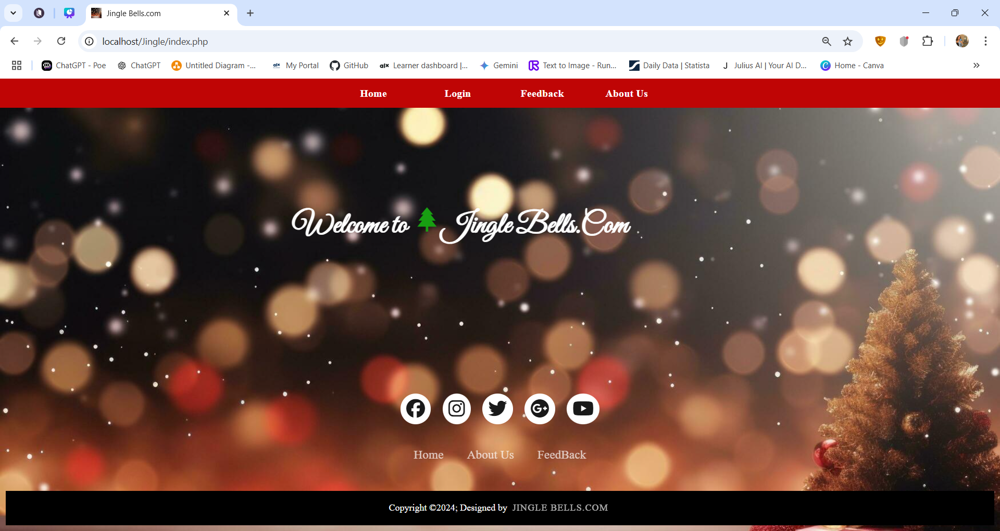

- **Registration Page**:

  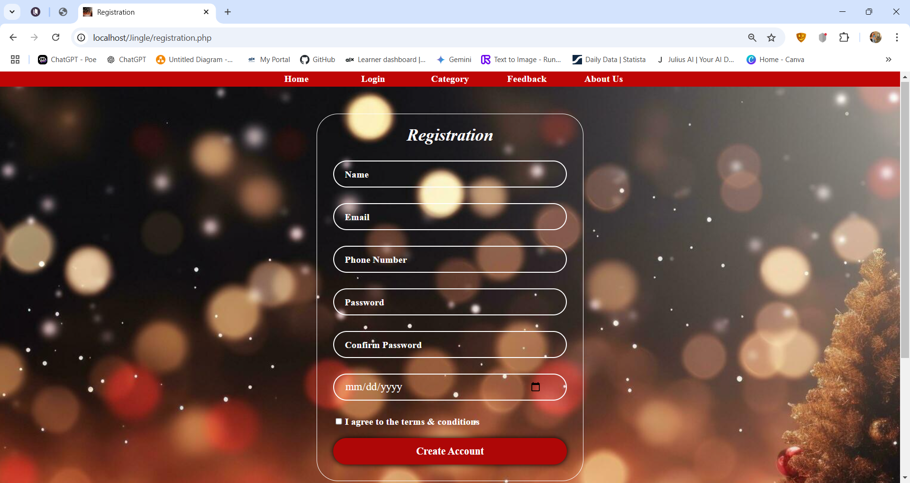

- **Login Page**:

  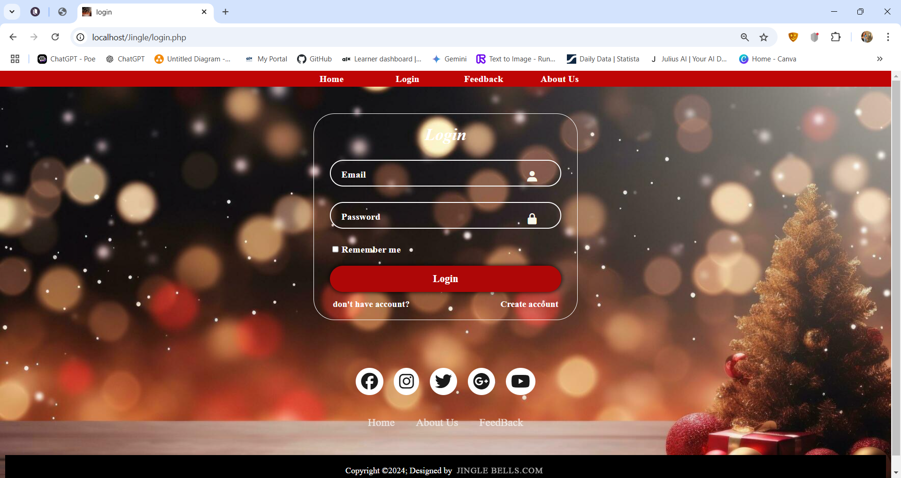

  **Categories Page**:

  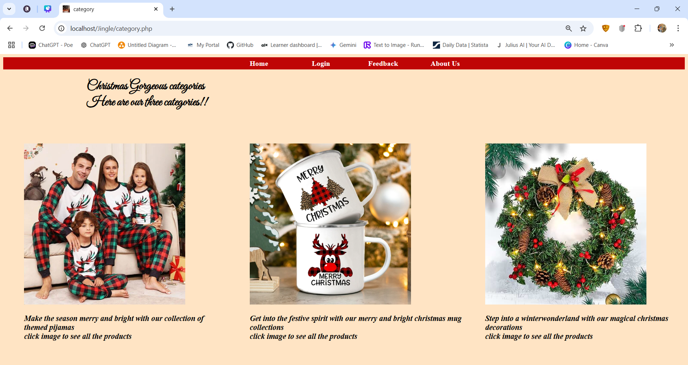

- **Products Page**:

  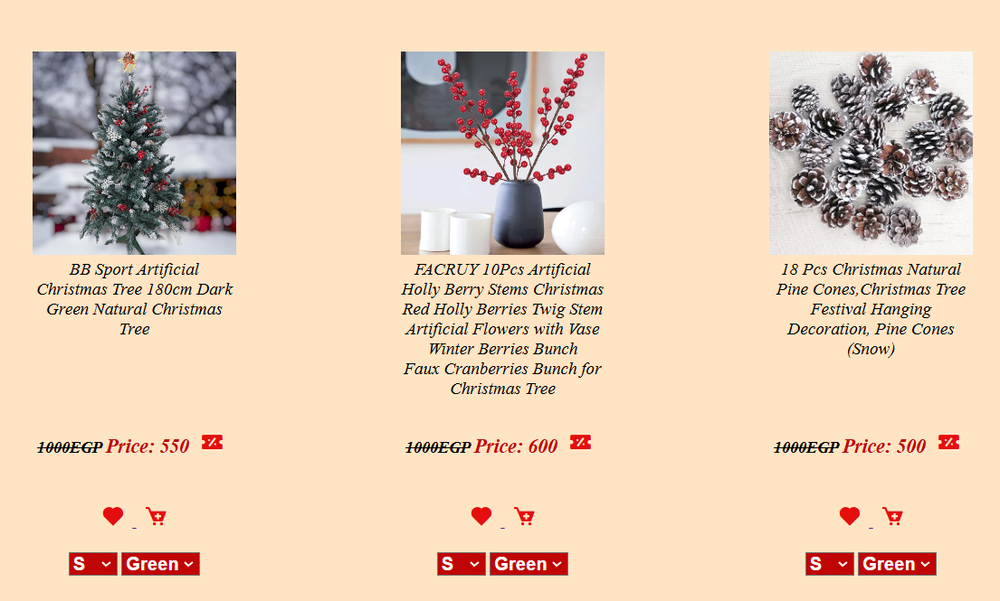

- **Payment Page**:

  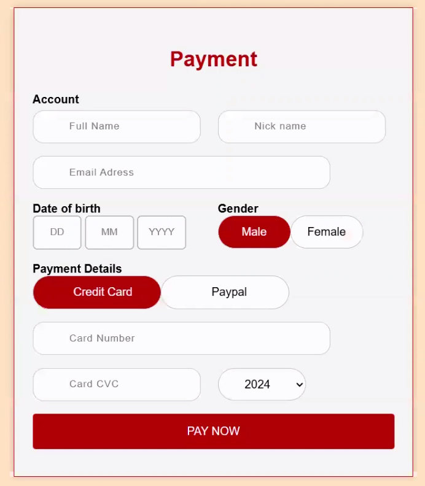

  **About Us**:

  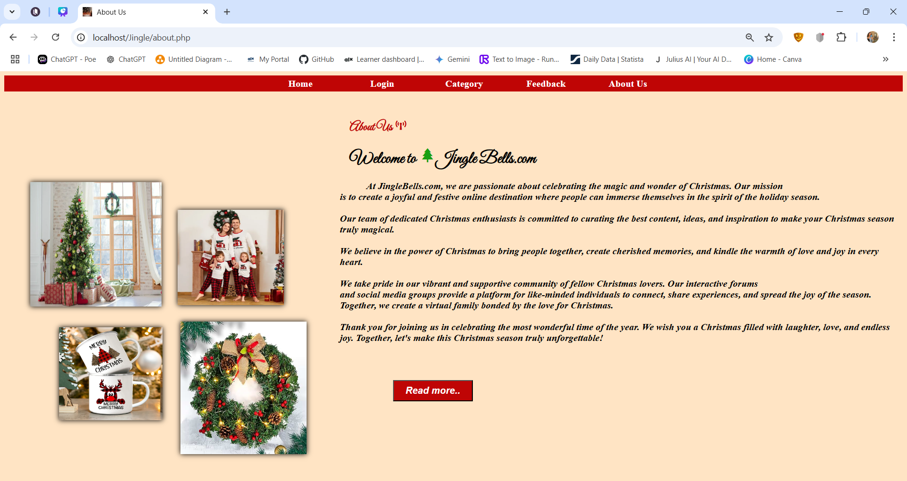

  **Feedback**:

  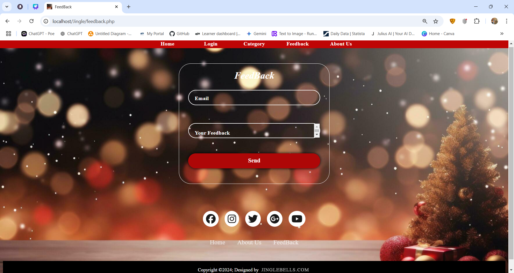

- **Admin Panel**:

  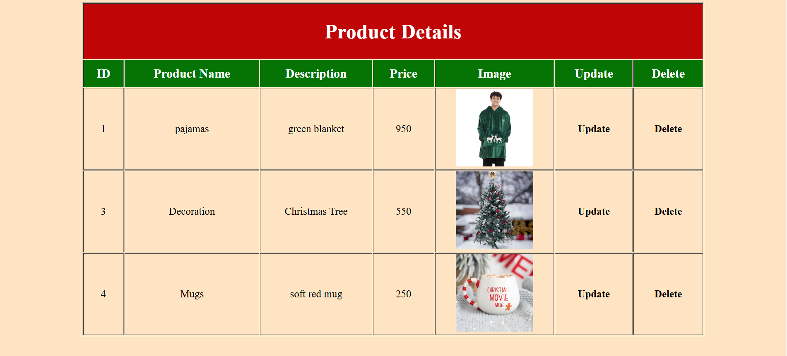

- **Add Product Page**:

  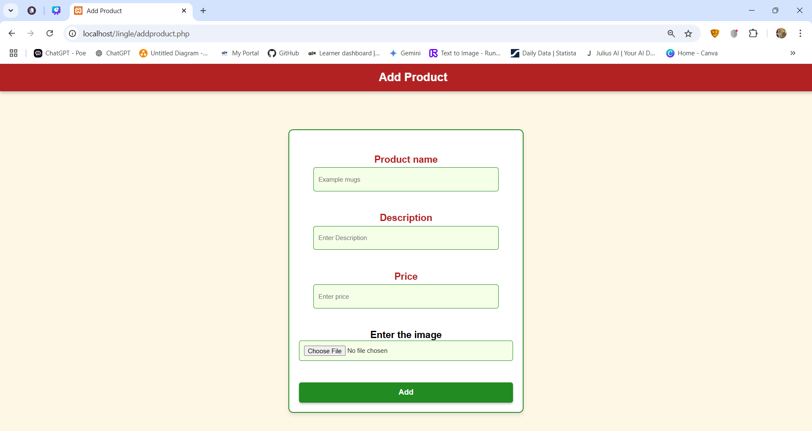

- **Update Product Page**:

  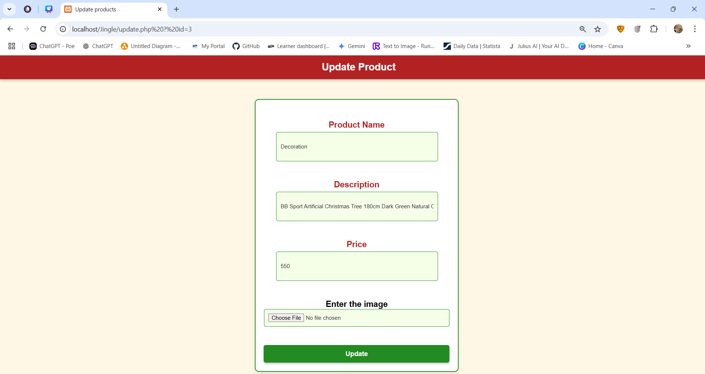

🛠 ## Future Enhancements

- Key challenges included securing data, managing user access, and handling database queries.

- To address security, we implemented strict input validation and encrypted user passwords.

- Database optimization helped boost performance, ensuring a fast and scalable platform.

- Designing a responsive interface required repeated testing and feedback to improve usability.

- Future upgrades may involve integrating payment systems, adding customer reviews, and creating a mobile app.

- Plans for advanced features include AI-based recommendations and real-time inventory tracking.

- We are committed to continuous improvement, guided by user feedback and evolving needs.

🌟 ## Contributors

- **[Maria Atef]** - Developer and Designer

## Contact Information

For any inquiries or support, please contact:

- **Email**: [JingleBells@gmail.com](mailto:JingleBells@gmail.com)

---

🎅 *Happy Holidays, and thank you for supporting Jingle Bells! We hope you enjoy exploring our festive offerings..*
```